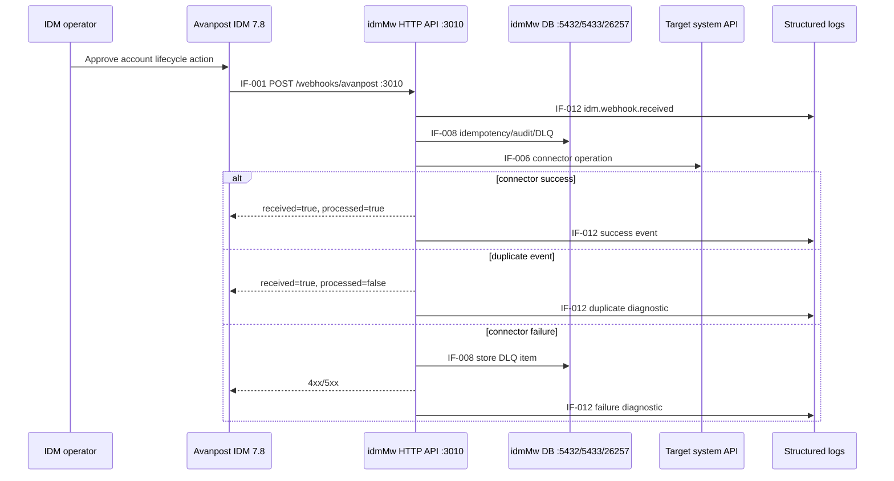
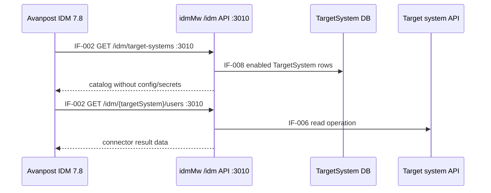
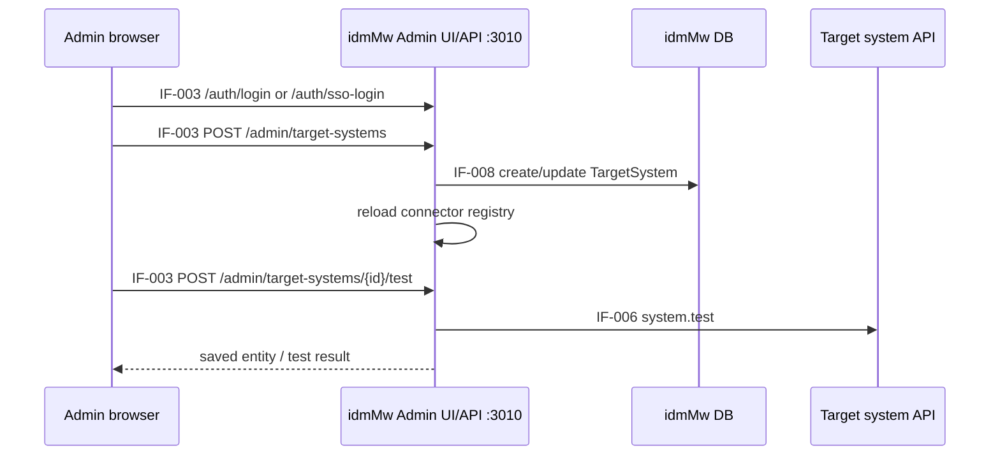
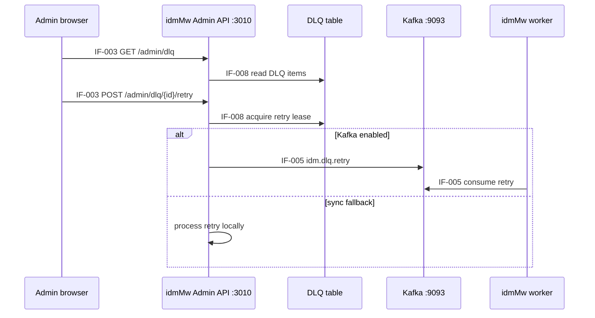
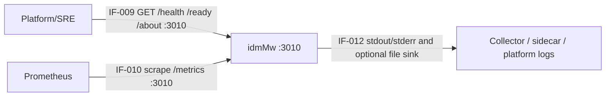

# Business Processes

## BP-001 Managed Account Provisioning

Positive scenario: IDM sends a unique event with `eventId`, `operation`,
`targetSystem` and `payload`; idmMw routes it to the configured connector and
returns a safe result.

Negative scenario: invalid payload, unknown target system, duplicate event or
connector failure returns an error or `processed=false`; DLQ and structured logs
record the failure without secret values.

Reusable subprocesses: idempotency check, connector registry lookup, retry/DLQ
handling, audit log write and diagnostic logging.

## BP-002 IDM Catalog and Read Facade

Negative scenario: disabled or unknown target systems return `404`; invalid
query parameters return `400`; connector failure returns `400` without leaking
stored connector configuration.

Logging points: catalog lookup, connector read execution, connector failure.

## BP-003 Admin Target System Operations

Negative scenario: unauthenticated admin request is rejected when
`ADMIN_AUTH_ENABLED=true`; duplicate target system name returns conflict; test
failure returns safe diagnostic text.

Logging points: admin auth result, TargetSystem CRUD, registry reload,
connection test.

## BP-004 DLQ Review and Retry

Negative scenario: an already leased, skipped or resolved DLQ item cannot be
retried again until the lease state permits it.

## BP-005 Monitoring and Support

Support processes include startup verification, readiness checks, metric
scraping, debug logging at `Basic` or temporary `Verbose`, key rotation and
container image provenance checks.
