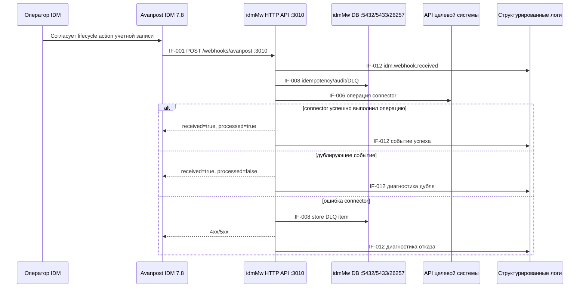
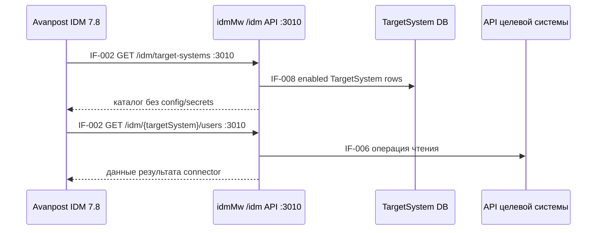
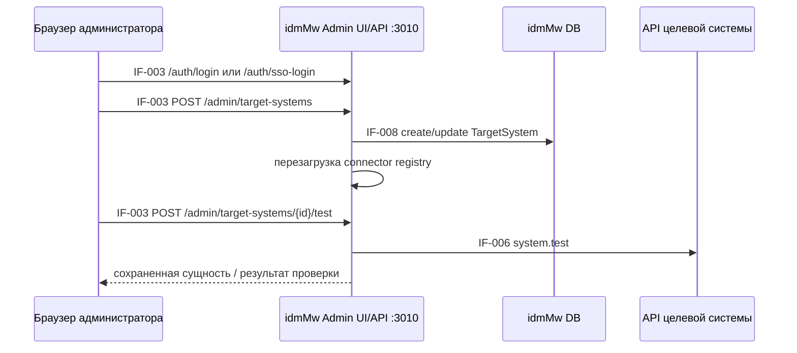
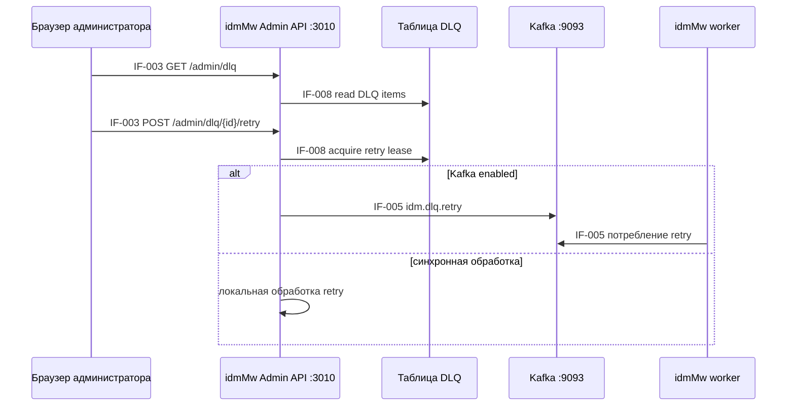
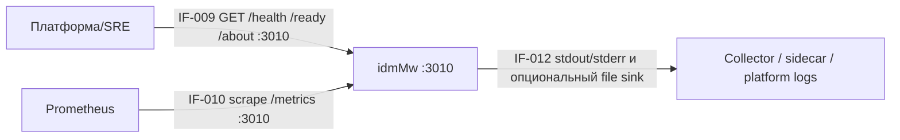

# Бизнес-процессы

## BP-001 Provisioning управляемой учетной записи

Позитивный сценарий: IDM отправляет уникальное событие с `eventId`,
`operation`, `targetSystem` и `payload`; idmMw маршрутизирует его в
настроенный connector и возвращает безопасный результат.

Негативный сценарий: некорректный payload, неизвестная target system,
дублирующее событие или отказ connector возвращают ошибку либо
`processed=false`; DLQ и structured logs фиксируют отказ без secret values.

Переиспользуемые подпроцессы: проверка idempotency, поиск в connector registry,
обработка retry/DLQ, запись audit log и diagnostic logging.

## BP-002 IDM catalog и read facade

Негативный сценарий: disabled или неизвестные target systems возвращают `404`;
некорректные query parameters возвращают `400`; отказ connector возвращает
`400` без раскрытия сохраненной connector configuration.

Точки логирования: поиск в catalog, выполнение чтения connector, отказ
connector.

## BP-003 Admin операции с TargetSystem

Негативный сценарий: неаутентифицированный admin request отклоняется при
`ADMIN_AUTH_ENABLED=true`; дублирующее target system name возвращает conflict;
ошибка test возвращает безопасный diagnostic text.

Точки логирования: результат admin auth, TargetSystem CRUD, перезагрузка
registry, проверка соединения.

## BP-004 DLQ review и retry

Негативный сценарий: DLQ item в состояниях already leased, skipped или resolved
нельзя повторно отправить в retry, пока состояние lease этого не позволяет.

## BP-005 Monitoring и support

Support-процессы включают проверку startup, readiness checks, сбор метрик,
debug logging на уровне `Basic` или временном redacted `Verbose`, key rotation
и проверки provenance container image.
