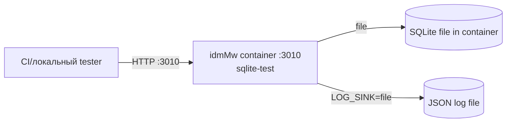
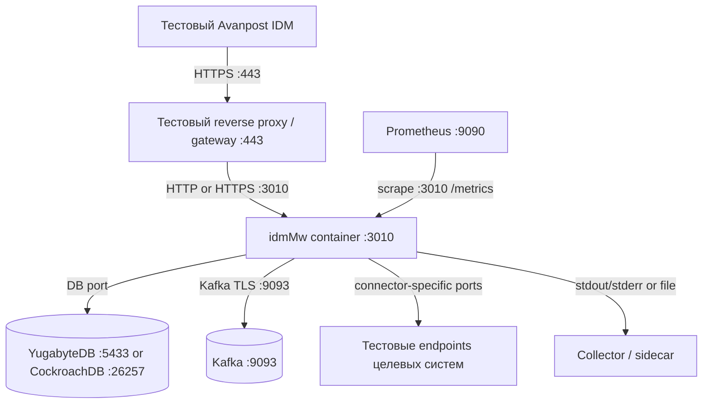

# Развертывание

Репозиторий предоставляет image-only Compose profiles для контуров,
ориентированных на администраторов. Development-only локальные Node workflows
являются справочной информацией, а не GKM deployment contours.

## Тестовый ИТ-контур

Тестовый ИТ-контур использует disposable profile `sqlite-test` для CI smoke и локальной
container verification.



| Соединение | Протокол / порт | Конфигурация |
| --- | --- | --- |
| Tester to idmMw | HTTP `3010` | `PORT=3010` |
| idmMw to SQLite | local file | `DATABASE_URL=file:/tmp/...` |
| Логи idmMw | file plus stdout/stderr | `LOG_SINK=file` |

## Контур бизнес-тестирования

Контур бизнес-тестирования должен использовать ту же topology, что и
Production, но с non-production значениями: внешняя PostgreSQL-compatible DB,
Kafka при проверке async mode, production-like TLS, admin auth и защита metrics.



## Промышленный контур

Production HA использует prebuilt images, несколько одинаковых idmMw workers за
внешним reverse proxy/load balancer, внешние DB и Kafka, защищенный Admin UI,
encrypted persisted payloads и operational log sink.

```mermaid
flowchart TB
  IDM[Промышленный Avanpost IDM]
  LB[Reverse proxy / load balancer :443]
  App1[idmMw worker 1 :3010]
  App2[idmMw worker 2 :3010]
  AppN[idmMw worker N :3010]
  DB[(YugabyteDB YSQL :5433\nor CockroachDB :26257)]
  Kafka[(Kafka cluster :9093)]
  Redis[(Redis optional :6379)]
  Prom[Prometheus :9090]
  Logs[Collector / sidecar / platform logging]
  PAM[Indeed PAM/AAPM :443]
  Targets[Целевые системы]

  IDM -->|HTTPS :443| LB
  LB -->|HTTP(S) :3010| App1
  LB -->|HTTP(S) :3010| App2
  LB -->|HTTP(S) :3010| AppN
  App1 -->|DB| DB
  App2 -->|DB| DB
  AppN -->|DB| DB
  App1 -->|Kafka TLS :9093| Kafka
  App2 -->|Kafka TLS :9093| Kafka
  AppN -->|Kafka TLS :9093| Kafka
  App1 -. optional Redis :6379 .-> Redis
  App2 -. optional Redis :6379 .-> Redis
  AppN -. optional Redis :6379 .-> Redis
  App1 -->|HTTPS :443 optional| PAM
  App1 -->|connector-specific ports| Targets
  App2 -->|connector-specific ports| Targets
  AppN -->|connector-specific ports| Targets
  Prom -->|HTTP(S) :3010 /metrics| App1
  Prom -->|HTTP(S) :3010 /metrics| App2
  Prom -->|HTTP(S) :3010 /metrics| AppN
  App1 --> Logs
  App2 --> Logs
  AppN --> Logs
```

| Контур | Compose / env | Обязательные проверки |
| --- | --- | --- |
| Тестовый ИТ-контур | `deploy/docker-compose.sqlite-test.yml`, `deploy/profiles/sqlite-test.env.example` | profile validation, smoke, `/health`, `/about`, `/metrics` |
| Контур бизнес-тестирования | `deploy/docker-compose.prod-ha.yml`, copied non-prod env | `docker compose config`, migration, readiness, Kafka/DB/TLS smoke |
| Промышленный контур | `deploy/docker-compose.prod-ha.yml`, `prod-ha-yugabyte` или `prod-ha-cockroach` env | verified image identity, migration, `/ready`, metrics, external log route |

## Инварианты production

- Runtime host использует только `image:`, не `build:`.
- `ADMIN_AUTH_ENABLED=true`.
- `HTTP_TLS_ENABLED=true` или trusted gateway TLS явно документирован.
- `INTEGRATION_AUTH_ENABLED=true`.
- `ENCRYPTION_ENABLED=true`.
- `IDMMW_PROCESSING_MODE=async` требует `KAFKA_ENABLED=true`.
- `METRICS_PUBLIC_ENABLED=false`, если route не изолирован платформой.
- Structured logs всегда идут в stdout/stderr; `LOG_SINK=file` plus sidecar или
  platform collector обеспечивает второй operational route.
