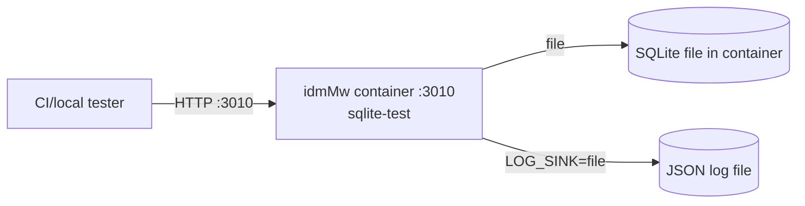
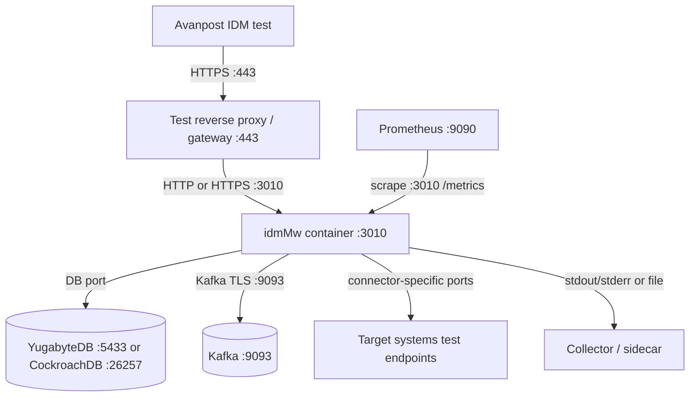

# Deployment

The repository provides image-only Compose profiles for administrator-facing
contours. Development-only local Node workflows are reference information, not
GKM deployment contours.

## Test IT

Test IT uses the disposable `sqlite-test` profile for CI smoke and local
container verification.



| Connection | Protocol / port | Config |
| --- | --- | --- |
| Tester to idmMw | HTTP `3010` | `PORT=3010` |
| idmMw to SQLite | local file | `DATABASE_URL=file:/tmp/...` |
| idmMw logs | file plus stdout/stderr | `LOG_SINK=file` |

## Business Test

Business Test should use the same topology as Production with non-production
values: external PostgreSQL-compatible DB, Kafka when async mode is tested,
production-like TLS, admin auth and metrics protection.



## Production

Production HA uses prebuilt images, multiple identical idmMw workers behind an
external reverse proxy/load balancer, external DB and Kafka, protected Admin UI,
encrypted persisted payloads and an operational log sink.

```mermaid
flowchart TB
  IDM[Avanpost IDM production]
  LB[Reverse proxy / load balancer :443]
  App1[idmMw worker 1 :3010]
  App2[idmMw worker 2 :3010]
  AppN[idmMw worker N :3010]
  DB[(YugabyteDB YSQL :5433\nor CockroachDB :26257)]
  Kafka[(Kafka cluster :9093)]
  Redis[(Redis optional :6379)]
  Prom[Prometheus :9090]
  Logs[Collector / sidecar / platform logging]
  PAM[Indeed PAM/AAPM :443]
  Targets[Target systems]

  IDM -->|HTTPS :443| LB
  LB -->|HTTP(S) :3010| App1
  LB -->|HTTP(S) :3010| App2
  LB -->|HTTP(S) :3010| AppN
  App1 -->|DB| DB
  App2 -->|DB| DB
  AppN -->|DB| DB
  App1 -->|Kafka TLS :9093| Kafka
  App2 -->|Kafka TLS :9093| Kafka
  AppN -->|Kafka TLS :9093| Kafka
  App1 -. optional Redis :6379 .-> Redis
  App2 -. optional Redis :6379 .-> Redis
  AppN -. optional Redis :6379 .-> Redis
  App1 -->|HTTPS :443 optional| PAM
  App1 -->|connector-specific ports| Targets
  App2 -->|connector-specific ports| Targets
  AppN -->|connector-specific ports| Targets
  Prom -->|HTTP(S) :3010 /metrics| App1
  Prom -->|HTTP(S) :3010 /metrics| App2
  Prom -->|HTTP(S) :3010 /metrics| AppN
  App1 --> Logs
  App2 --> Logs
  AppN --> Logs
```

| Contour | Compose / env | Required checks |
| --- | --- | --- |
| Test IT | `deploy/docker-compose.sqlite-test.yml`, `deploy/profiles/sqlite-test.env.example` | profile validation, smoke, `/health`, `/about`, `/metrics` |
| Business Test | `deploy/docker-compose.prod-ha.yml`, copied non-prod env | `docker compose config`, migration, readiness, Kafka/DB/TLS smoke |
| Production | `deploy/docker-compose.prod-ha.yml`, `prod-ha-yugabyte` or `prod-ha-cockroach` env | verified image identity, migration, `/ready`, metrics, external log route |

## Production Invariants

- Runtime host consumes `image:` only, not `build:`.
- `ADMIN_AUTH_ENABLED=true`.
- `HTTP_TLS_ENABLED=true` or trusted gateway TLS is explicitly documented.
- `INTEGRATION_AUTH_ENABLED=true`.
- `ENCRYPTION_ENABLED=true`.
- `IDMMW_PROCESSING_MODE=async` requires `KAFKA_ENABLED=true`.
- `METRICS_PUBLIC_ENABLED=false` unless the route is isolated.
- Structured logs always go to stdout/stderr; `LOG_SINK=file` plus sidecar or
  platform collector provides the second operational route.
